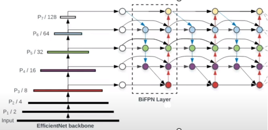

# Airbus Ship Detection Challenge

In this project, we are required to locate ships in images, and put an aligned bounding box segment around the ships you
locate. Many images do not contain ships, and those that do may contain multiple ships.
Ships within and across images may differ in size (sometimes significantly) and be located in open sea, at docks,
marinas, etc.

The dataset is on the kaggle platform [here](https://www.kaggle.com/c/airbus-ship-detection/data).

# Local development

### Install requirements

Create virtual environment from python3.9<br>

```
python3 -m venv /path/to/new/virtual/environment
```

Install requirements<br>

```
pip install -r requirements.txt
```

### How to train a model
Set the environment variables:

    TRAIN_DIR={path to directory with train images}
    TARGET_LABELS_DATASET={path to dataset with target labels}
Run the train file

    python ./train/train.py
### How to use a model
The trained model is saved in the checkpoint directory. It will be used to segment new images.

To segment a new image, you need to call the `predict` method (in the `inference/prediction.py` file), passing the loaded trained model and the path to the image.

# 🎯 Solution
1. Data analysis was carried out ([data-analysis](https://github.com/VLADISLAV008/Airbus-Ship-Detection-Challenge/blob/master/data-analysis.ipynb)).
It was found that most of the images (78%) do not contain ships.
All the ships in the images take up a very small part (approximately 0,1%), the pictures contain a lot of background.
Also, target segmentation for labeled pictures consists of bounding boxes (rectangles). Ships do not intersect, but their borders in some images have adjacent borders.
2. The UNet network was chosen as the architecture of the neural network for semantic segmentation, which allows high-precision segmentation of images, highlighting all the ships in the image.
For better accuracy and fewer model parameters, we use a MobileNetV2 classification model with trained weights as an encoder.
The resulting neural network architecture is shown below.

4. Then we train the instance segmentation model - Deep Watershed Transform , which will separate the ships using the semantic segmentation that the UNet model produces.

# How can we try to improve the model
1. Pretrain the encoder for classifying ships. And then do not change the encoder weights when training the segmentation model.
2. Use Data Augmentation for images with ships
3. Reduce the number of images without ships when training the model
4. Use original image shape (768 * 768 * 3) when training model
5. As an encoder,  we can try use EfficientDet with already trained weights


# 📜 Contributors
[](https://github.com/VLADISLAV008)
